# PATTERNS.md — Build Playbooks

> How to build each pattern in the **[Design Patterns catalog](KNOWLEDGE_STACK.md)**. Every playbook follows the same template: **Problem & when to use** → **Stack** → **How to build it** → **Reference implementation** (in my repos) → **Gotchas / tradeoffs**. Prefer these for anything architectural; see **[AGENTS.md](AGENTS.md)** for the operating contract.

**Catalog**

Backend / API — [1. BFF and Domain-API split](#1-bff-and-domain-api-split) · [2. Layered NestJS service](#2-layered-nestjs-service) · [3. Repository over raw-SQL migrations](#3-repository-over-raw-sql-migrations) · [4. Firebase-Functions-hosted NestJS](#4-firebase-functions-hosted-nestjs) · [5. Versioned ingestion pipeline](#5-versioned-ingestion-pipeline)

Auth / security — [6. HMAC-signed stateless tokens](#6-hmac-signed-stateless-tokens) · [7. Internal API-key guard](#7-internal-api-key-guard) · [8. On-device end-to-end encryption](#8-on-device-end-to-end-encryption)

Mobile / data — [9. Flutter clean-layered with Riverpod](#9-flutter-clean-layered-with-riverpod) · [10. Offline-first local-SQLite source of truth](#10-offline-first-local-sqlite-source-of-truth)

Cross-cutting — [11. Cross-platform design tokens](#11-cross-platform-design-tokens) · [12. Monorepo with shared schema package](#12-monorepo-with-shared-schema-package) · [13. Forced tool-use for structured LLM output](#13-forced-tool-use-for-structured-llm-output)

---

## 1. BFF and Domain-API split

**Problem & when to use** — You want a hard secret/privacy boundary and a clean split between presentation and domain logic. The browser talks only to your own origin; secrets (DB service-role key, LLM keys, token secret) never reach the client. Use when an app has meaningful server-side secrets or a domain API worth reusing across clients. Skip for static/marketing sites.

**Stack** — Next.js App Router (route handlers as the BFF) · NestJS domain API · Supabase Postgres · internal API key (pattern 7) · Vercel (web) + Fly.io (api).

**How to build it**
1. Two deployables: `web/` (Next.js) renders UI and exposes `/api/*` route handlers; `web-api/` (NestJS) owns **all** DB access, business rules, and secrets.
2. The browser calls only same-origin `/api/*`. Those handlers call the Nest API **server-to-server** — never from the client.
3. Authenticate the BFF→API hop with an internal API key (pattern 7); authenticate end users at the BFF (Supabase Auth or HMAC tokens).
4. Share DTOs/types via one package (pattern 12) so both sides agree.
5. Deploy web to Vercel and the API to Fly.io; co-locate the API's region with Supabase.

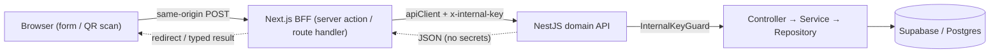

**Examples**

#### Example 1: Server-only API client holds the secret
The only place `INTERNAL_API_KEY` and the API base URL live. `import "server-only"` makes the build fail if it's ever pulled into a client bundle, so the key can never reach the browser. Every call is server-to-server and stamps the `x-internal-key` header.
```ts
import "server-only";
import { SubmitResponse } from "@crp/shared";

function cfg() {
  const base = process.env.WEB_API_BASE_URL;
  const key = process.env.INTERNAL_API_KEY;
  if (!base || !key) throw new Error("Missing WEB_API_BASE_URL or INTERNAL_API_KEY");
  return { base, key };
}

export async function submitResponse(input: {
  token: string; responseText?: string; chosenOption?: string;
}): Promise<{ ok: true; sessionId: string } | { ok: false; reason: string }> {
  const { base, key } = cfg();
  const res = await fetch(`${base}/responses`, {
    method: "POST",
    headers: { "content-type": "application/json", "x-internal-key": key },
    body: JSON.stringify(input),
    cache: "no-store",
  });
  if (res.ok) return { ok: true, sessionId: SubmitResponse.parse(await res.json()).sessionId };
  if (res.status === 409) return { ok: false, reason: "closed" };  // map status → domain reason
  return { ok: false, reason: "error" };
}
```
*Source: web/src/lib/apiClient.ts*

#### Example 2: BFF entry points — the browser only ever hits same-origin
The browser submits a form (Server Action) or scans a QR code (Route Handler). Neither touches a secret or a DB; they delegate to the typed client and translate the result into UI state or a redirect.
```ts
// app/p/[token]/actions.ts  — Server Action invoked by a <form>
"use server";
import { submitResponse } from "@/lib/apiClient";

export async function submitResponseAction(_prev: SubmitState, form: FormData): Promise<SubmitState> {
  const result = await submitResponse({
    token: String(form.get("token") ?? ""),
    responseText: (form.get("responseText") as string)?.trim() || undefined,
  });
  if (!result.ok) return { status: "error", message: ERROR_COPY[result.reason] };
  // … set httpOnly cookie, return success
  return { status: "success" };
}

// app/s/[studioQrId]/route.ts  — public QR entry, Route Handler
export async function GET(req: NextRequest, ctx: { params: Promise<{ studioQrId: string }> }) {
  const { studioQrId } = await ctx.params;
  const result = await resolveSession(studioQrId);          // server-to-server
  return result.ok
    ? NextResponse.redirect(new URL(`/p/${result.token}`, req.url))
    : NextResponse.redirect(new URL("/no-prompt", req.url));
}
```
*Source: web/src/app/p/[token]/actions.ts, web/src/app/s/[studioQrId]/route.ts*

#### Example 3: The domain API rejects anything but the BFF
Every Nest controller is guarded by `InternalKeyGuard`, which compares the `x-internal-key` header to the configured secret. A request that didn't come through the BFF is rejected with 401 before any handler or DB query runs.
```ts
@Injectable()
export class InternalKeyGuard implements CanActivate {
  constructor(private readonly config: AppConfig) {}
  canActivate(ctx: ExecutionContext): boolean {
    const req = ctx.switchToHttp().getRequest<{ headers: Record<string, string | undefined> }>();
    const key = req.headers["x-internal-key"];
    if (key !== this.config.env.INTERNAL_API_KEY) throw new UnauthorizedException("internal-key");
    return true;
  }
}

@UseGuards(InternalKeyGuard)        // applied to the whole controller
@Controller("responses")
export class ResponsesController {
  constructor(private readonly responses: ResponsesService) {}
  @Post()
  async submit(@Body() body: unknown) {
    const parsed = SubmitRequest.safeParse(body);       // validate at the boundary (Zod)
    if (!parsed.success) throw new BadRequestException(parsed.error.flatten());
    return this.responses.submit(parsed.data);          // → service → repository → Supabase
  }
}
```
*Source: web-api/src/common/auth/internal-key.guard.ts, web-api/src/modules/responses/responses.controller.ts*

**Reference implementation** — `lobbi`: `web/` (App Router + `proxy.ts` gating `/admin`), `web-api/` (Nest), `packages/shared` (Zod). Planned identically in `chorus`.

**Gotchas / tradeoffs** — Two deploys plus an extra network hop. The API must not be usable without the internal key. Worth it for the secret boundary and reusability; overkill for tiny apps.

---

## 2. Layered NestJS service

**Problem & when to use** — Keep HTTP concerns, business logic, and data access separate so each is independently testable and swappable. Use for any non-trivial Nest API.

**Stack** — NestJS · class-validator / class-transformer (or Zod) · @nestjs/swagger · Helmet · @nestjs/throttler.

**How to build it**
1. One **module** per domain concept (sessions, studios, restaurants…).
2. **Controller** = HTTP only: route, validate the DTO, call a service, shape the response. No business logic.
3. **Service** = business rules; depends on repositories via DI; no HTTP, no SQL.
4. **Repository** = data access only (supabase-js query builder or SQL); returns typed rows.
5. Cross-cutting: global validation pipe, Helmet, throttler, Swagger docs.
6. Unit-test services with mocked repositories; e2e-test controllers with Supertest.

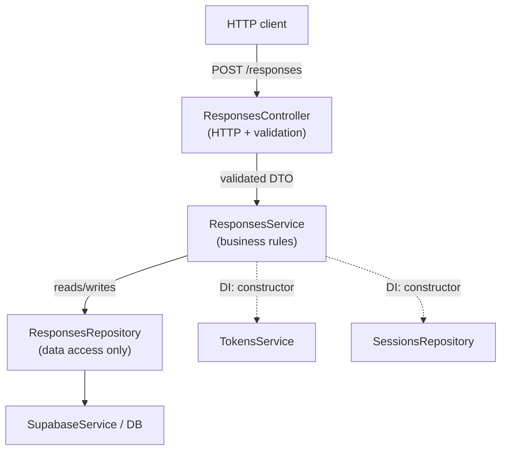

**Examples**

#### Example 1: Controller — HTTP edge only, validate then delegate
The controller's whole job: parse/validate the request body, then hand a typed value to the service. No business logic, no DB. Here lobbi validates with a shared Zod schema and throws `400` on failure.
```ts
@UseGuards(InternalKeyGuard)
@Controller('responses')
export class ResponsesController {
  constructor(private readonly responses: ResponsesService) {}

  @Post()
  async submit(@Body() body: unknown) {
    const parsed = SubmitRequest.safeParse(body);              // validate at the edge
    if (!parsed.success) throw new BadRequestException(parsed.error.flatten());
    return this.responses.submit(parsed.data);                 // delegate to service
  }
}
```
*Source: lobbi/web-api/src/modules/responses/responses.controller.ts*

#### Example 2: Service — business logic, orchestrates repositories
All the domain rules live here: verify the token, enforce the submission window, validate the choice against the prompt, then persist. The service depends on repositories (and other services) injected via the constructor — it never touches the DB driver directly.
```ts
@Injectable()
export class ResponsesService {
  constructor(
    private readonly tokens: TokensService,
    private readonly sessions: SessionsRepository,
    private readonly prompts: PromptsRepository,
    private readonly responses: ResponsesRepository,   // injected data access
  ) {}

  async submit(req: SubmitRequest): Promise<SubmitResponse> {
    const payload = this.tokens.verify(req.token);
    if (!payload) throw new UnauthorizedException('invalid-token');

    const session = await this.sessions.findById(payload.sessionId);
    if (!session) throw new NotFoundException('session-not-found');

    // business rule: submissions only allowed inside the open window
    const now = Date.now();
    const open = session.status === 'active' &&
      now >= Date.parse(session.starts_at) && now <= Date.parse(session.ends_at);
    if (!open) throw new ConflictException('session-closed');
    // … validate prompt + answer, then:
    await this.responses.insert({ /* … mapped row … */ });
    return { sessionId: payload.sessionId };
  }
}
```
*Source: lobbi/web-api/src/modules/responses/responses.service.ts (abridged)*

#### Example 3: Repository — data access only (no business rules)
The repository is the single place that talks to the database. It takes/returns plain row shapes, runs the query, surfaces driver errors, and contains zero domain logic.
```ts
@Injectable()
export class ResponsesRepository {
  constructor(private readonly supabase: SupabaseService) {}

  async insert(row: InsertResponseRow): Promise<void> {
    const { error } = await this.supabase.client.from('response').insert(row);
    if (error) throw error;          // surface DB errors; no business decisions here
  }
}
```
*Source: lobbi/web-api/src/modules/responses/responses.repository.ts*

#### Example 4 (variant): DTO validation via class-validator + global `ValidationPipe`
When the edge uses NestJS DTO classes instead of Zod, declare constraints with `class-validator` decorators and register a global `ValidationPipe`; Nest validates `@Body()` against the DTO before the controller runs.
```ts
// main.ts — validate every request body, strip unknown props
app.useGlobalPipes(new ValidationPipe({
  transform: true, whitelist: true, forbidNonWhitelisted: true,
}));

// create-restaurant-request.dto.ts
export class CreateRestaurantRequestDto {
  @IsString() @IsNotEmpty() name: string = '';
  @IsString() @IsNotEmpty() address: string = '';
  @IsNumber() @Min(0)       rating: number = 0.0;
  @IsArray()                photoUrls: string[] = [];
}

// controller — DTO arrives already validated
@Post()
async createRestaurant(@Body() dto: CreateRestaurantRequestDto) {
  return this.restaurantsService.createRestaurant(dto);
}
```
*Source: michelin-map/.../functions/src (main.ts, contracts/dto/create-restaurant-request.dto.ts, app/restaurants/restaurants.controller.ts)*

**Reference implementation** — `lobbi/web-api`, `michelin-map` web-api (`v1/app/...`), `yogicam/web-api`, the `canvas` APIs.

**Gotchas / tradeoffs** — Don't let logic leak into controllers or SQL into services. A module that keeps growing is a signal to split it.

---

## 3. Repository over raw-SQL migrations

**Problem & when to use** — You want full control of the Postgres schema and queries without an ORM's abstraction or lock-in. Use when the schema is hand-designed and you value explicit SQL + RLS.

**Stack** — Supabase Postgres · @supabase/supabase-js (service-role) · versioned `.sql` migration files.

**How to build it**
1. Keep numbered migrations (`0001_init.sql`, `0002_scheduling.sql`, …) in `web-api/src/db/migrations/`; apply in order through one canonical path.
2. Define RLS policies in SQL. The API uses the service-role key (RLS-bypassing) and enforces access in guards/code.
3. Wrap each table in a repository class using the supabase-js query builder (`.from().select().eq()`); return typed rows.
4. Validate inputs/outputs with Zod from the shared package.
5. Migrations are the schema's source of truth — review them like code.

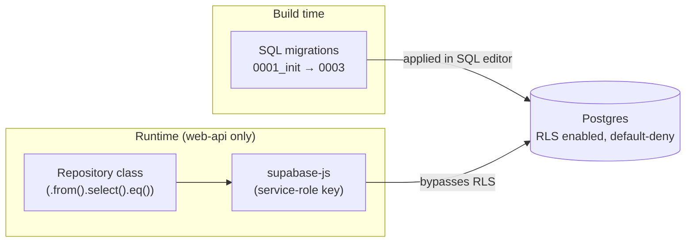

**Examples**

#### Example 1: Migration — table + RLS (enable-only, default-deny)
Hand-written versioned SQL on Supabase Postgres (no ORM). RLS is turned on for every table but **no policies are added**, so `anon`/`authenticated` get zero rows by default; only the service-role key (used by `web-api`) can read or write.
```sql
create table response (
  id                uuid primary key default gen_random_uuid(),
  prompt_session_id uuid not null references prompt_session(id) on delete cascade,
  role              response_role not null,            -- 'student' | 'teacher'
  response_text     text,
  chosen_option     text,
  submitted_at      timestamptz not null default now()
  -- … check constraints elided …
);

-- RLS: enable everywhere, default-deny (no policies yet) — web-api uses the
-- service-role key, which bypasses RLS; clients never touch the DB directly.
alter table response enable row level security;
```
*Source: web-api/src/db/migrations/0001_init.sql (constraints elided)*

#### Example 2: Repository method — wraps the supabase-js query builder
The repository is the single owner of DB access. It composes the query builder (`.from().select().eq().lte().gte()`) and translates any driver error into a thrown exception; access rules live in code, not in the DB.
```ts
@Injectable()
export class SessionsRepository {
  constructor(private readonly supabase: SupabaseService) {}

  /** Studio's currently-open session, resolved by time window. */
  async findActiveByStudioId(studioId: string) {
    const now = new Date().toISOString();
    const { data, error } = await this.supabase.client
      .from('prompt_session')
      .select('id, prompt_id')
      .eq('studio_id', studioId)
      .lte('starts_at', now)        // window has started
      .gte('ends_at', now)          // … and not yet ended
      .limit(1)
      .maybeSingle();
    if (error) throw error;         // surface DB errors, never swallow
    return data ?? null;
  }
}
```
*Source: web-api/src/modules/sessions/sessions.repository.ts (lightly trimmed)*

#### Example 3: The single DB client + Zod-validated secrets
One service-role client owns all DB access (so RLS-bypass is contained to the server), and the secret that grants it is validated at boot with Zod — the API refuses to start if `SUPABASE_SERVICE_ROLE_KEY` is missing.
```ts
// supabase.service.ts — server-only client, bypasses RLS
this.client = createClient(
  config.env.SUPABASE_URL,
  config.env.SUPABASE_SERVICE_ROLE_KEY,
  { auth: { persistSession: false, autoRefreshToken: false } },
);

// env.ts — validate secrets before anything boots
const EnvSchema = z.object({
  SUPABASE_URL: z.string().url(),
  SUPABASE_SERVICE_ROLE_KEY: z.string().min(1),
  // … other vars elided …
});
export const loadEnv = () => EnvSchema.parse(process.env);
```
*Source: web-api/src/supabase/supabase.service.ts + src/common/config/env.ts (merged & elided)*

> Note: the exemplar's RLS model is deliberately *enable-only / default-deny* — RLS is on for every table with **zero policies**, and `web-api` reaches the DB through the service-role key (which bypasses RLS). Authorization is enforced in code, not in `using (...)` policies.

**Reference implementation** — `lobbi/web-api/src/db/migrations`; `community-reflection-platform` (repositories + `TokensService`).

**Gotchas / tradeoffs** — You own migration ordering and rollbacks (no ORM safety net). The service-role key bypasses RLS, so authorization **must** be enforced in code. Keep a single apply path to avoid drift.

---

## 4. Firebase-Functions-hosted NestJS

**Problem & when to use** — You want a NestJS API but prefer Firebase/GCP serverless hosting (and Firebase Hosting for the web). Use when you're already in the Firebase ecosystem (RTDB / Firestore / Auth).

**Stack** — NestJS · firebase-functions (v2) · Express adapter · Firebase Hosting (`frameworksBackend`) · multi-env Firebase projects.

**How to build it**
1. Build the Nest app normally, but instead of `app.listen()`, instantiate it over an Express instance and export it as an `onRequest` Cloud Function.
2. Use `onSchedule` (or Cloud Scheduler) for cron work.
3. Pin the Node runtime in `engines`; configure `firebase.json` (functions + hosting `frameworksBackend`).
4. Multi-env: separate Firebase projects (dev / beta / prod) via `.firebaserc` + `.env.{development,beta,production}`; deploy per env in CI.
5. Deploy the web app via Firebase Hosting frameworks support: `firebase deploy --only hosting`.

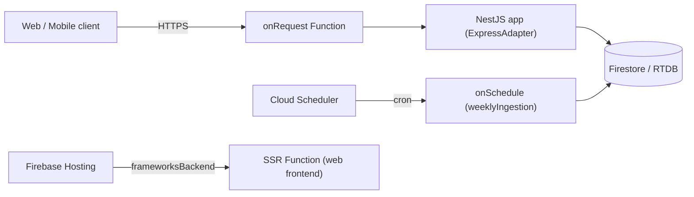

**Examples**

#### Example 1: Nest-over-Express bootstrapped as an `onRequest` function
Create one Express instance, mount a NestJS app onto it via `ExpressAdapter`, init it once at cold start, then export the Express app as a single HTTPS Cloud Function.
```ts
import * as functions from 'firebase-functions';
import * as express from 'express';
import { NestFactory } from '@nestjs/core';
import { ExpressAdapter } from '@nestjs/platform-express';
import { ValidationPipe } from '@nestjs/common';
import { AppModule } from './app.module';

const server = express();

export const createNestServer = async (expressInstance: express.Express) => {
  const app = await NestFactory.create(AppModule, new ExpressAdapter(expressInstance));
  app.enableCors({ origin: process.env.FRONTEND_URL || '*' });
  app.useGlobalPipes(new ValidationPipe({ whitelist: true, transform: true }));
  app.setGlobalPrefix('api');
  return app.init(); // init() (not listen()) — the Function owns the HTTP server
};

// Warm the Nest app at cold start so requests reuse it
createNestServer(server).catch((err) => console.error('Nest broken', err));
functions.setGlobalOptions({ memory: '512MiB' });

// Firebase Function name: yogicamAPI — all routes flow through Nest
export const yogicamAPI = functions.https.onRequest(server);
```
*Source: yogicam/web-api/functions/src/index.ts (lightly condensed)*

#### Example 2: Scheduled cron via `onSchedule` (v2 scheduler)
A second-gen scheduled function replaces an in-process `@Cron`. Cloud Scheduler invokes it on the declared cadence; it lazily inits the Admin SDK, does its work, and writes a run report. Secrets are bound per-function.
```ts
import * as admin from 'firebase-admin';
import { onSchedule } from 'firebase-functions/v2/scheduler';

export const weeklyIngestion = onSchedule(
  {
    schedule: 'every monday 03:00',
    timeZone: 'UTC',
    memory: '512MiB',
    timeoutSeconds: 540,
    secrets: ['GOOGLE_PLACES_API_KEY'],
  },
  async () => {
    if (admin.apps.length === 0) admin.initializeApp();
    const db = admin.firestore();
    const apiKey = process.env.GOOGLE_PLACES_API_KEY;
    const report = await runScheduledIngestion({ db, apiKey, /* … */ });
    console.log('Weekly ingestion complete:', JSON.stringify(report.summary));
  },
);
```
*Source: michelin-map/michelin-map-web-api/functions/src/index.ts (lightly condensed)*

#### Example 3: `firebase.json` — Functions codebase + Hosting `frameworksBackend`
The `functions` block builds and deploys the API codebase (the `predeploy` hook compiles TS first). A separate Hosting site uses `frameworksBackend` so Firebase auto-provisions the SSR/web framework backend in the chosen region.
```json
{
  "functions": [
    {
      "source": "functions",
      "codebase": "yogicam",
      "ignore": ["node_modules", ".git", "*.local"],
      "predeploy": ["npm --prefix \"$RESOURCE_DIR\" run build"]
    }
  ],
  "hosting": {
    "source": ".",
    "ignore": ["firebase.json", "**/.*", "**/node_modules/**"],
    "frameworksBackend": { "region": "us-central1" }
  }
}
```
*Source: composed from yogicam/web-api/firebase.json (functions) + yogicam/web/firebase.json (hosting). Illustrative — they live in separate files.*

**Reference implementation** — `canvas` (web / music / messaging APIs), `michelin-map`, `yogicam`, `form-api`.

**Gotchas / tradeoffs** — Cold starts and function timeout limits; the Express wrap has minor Nest-lifecycle nuances. Watch per-env config drift — and keep deployment docs honest (yogicam's README once claimed Vercel while it actually deploys here).

---

## 5. Versioned ingestion pipeline

**Problem & when to use** — You ingest external or scraped data on a schedule and need it normalized, enriched, and reconciled into a canonical store. Use for ETL / data-sync features.

**Stack** — NestJS (`@nestjs/schedule` or Cloud Scheduler) · source adapters · parser · normalizer · enrichment client (e.g., Google Places) · reconciler · Firestore/Postgres canonical repo.

**How to build it**
1. Version the pipeline (`v1/`) so it can evolve without breaking history.
2. Build stages as discrete, testable units: **source-adapter** (fetch raw — scrape / CSV / API) → **parser** (raw → structured) → **normalizer** (canonical shape) → **enrichment** (augment via external API) → **reconciler** (merge vs. existing canonical, dedupe) → **repository** (persist).
3. Record each run (e.g., an `ingestion_runs` report) for observability.
4. Trigger on a schedule (weekly cron); make every stage idempotent.
5. Unit-test each stage against fixtures.

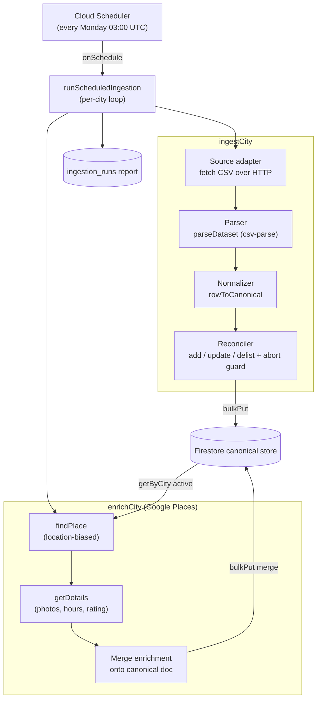

**Examples**

#### Example 1: Stage ports — narrow interfaces so each stage is swappable and testable
The pipeline is wired against two ports: a storage port (`CanonicalRestaurantRepo`) and a provider port (`PlacesClient`). Firestore and Google Places are the production implementations; tests inject in-memory fakes with no network.
```ts
/** Storage port. Firestore is one implementation; tests use an in-memory fake. */
export interface CanonicalRestaurantRepo {
  getByCity(cityId: string): Promise<StoredMichelinRestaurant[]>;
  bulkPut(records: StoredMichelinRestaurant[]): Promise<void>;
}

/** Provider port — kept narrow so enrichment can run against a fake. */
export interface PlacesClient {
  findPlace(query: PlaceQuery): Promise<PlaceMatch | null>; // location-biased match
  getDetails(placeId: string): Promise<PlaceDetails>;       // photos, hours, reviews…
}
```
*Source: functions/src/v1/app/scraping/michelin-reconciler.ts, places-client.ts*

#### Example 2: Reconciler stage — idempotent upsert with a mass-delist safety guard
The reconciler diffs a freshly-fetched city against the stored canonical set: insert new, refresh re-seen, and increment a miss counter for absences (delisting only after N consecutive misses). If a fetch looks broken it writes nothing rather than wiping the store.
```ts
export async function reconcileCity(cityId, fresh, repo, now = new Date().toISOString()) {
  const existing = await repo.getByCity(cityId);
  const activeCount = existing.filter((r) => r.status === 'active').length;

  // Broken-source guard: a suspiciously small fetch aborts instead of mass-delisting.
  if (fresh.length === 0 || (activeCount > 0 && fresh.length < activeCount * (1 - MAX_DROP_RATIO)))
    return { cityId, aborted: true, reason: 'fetch too small — refusing to mass-delist' };

  const existingById = new Map(existing.map((r) => [r.sourceId, r]));
  const writes = [];
  for (const f of fresh) {
    const prev = existingById.get(f.sourceId);
    // `...prev` first preserves enrichment fields; `...f` overlays fresh source data.
    writes.push(prev
      ? { ...prev, ...f, cityId, status: 'active', lastSeenAt: now, missCount: 0 }
      : { ...f, cityId, status: 'active', firstSeenAt: now, lastSeenAt: now, missCount: 0 });
  }
  // … absent records: missCount++, delist once missCount >= DELIST_AFTER_MISSES …
  await repo.bulkPut(writes);
  return report;
}
```
*Source: functions/src/v1/app/scraping/michelin-reconciler.ts (elided)*

#### Example 3: Pipeline wiring under the weekly `onSchedule` trigger
The job body is kept free of any Firebase/Nest coupling — the trigger injects the concrete Firestore repo, Places client, and report sink — so the whole pipeline is unit-testable with fakes.
```ts
export const weeklyIngestion = onSchedule(
  { schedule: 'every monday 03:00', timeZone: 'UTC', secrets: ['GOOGLE_PLACES_API_KEY'] },
  async () => {
    const db = admin.firestore();
    const apiKey = process.env.GOOGLE_PLACES_API_KEY;
    const places = apiKey ? new GooglePlacesClient(apiKey) : null; // enrich only if keyed

    await runScheduledIngestion({
      cities: CITY_CONFIGS,
      repo: new FirestoreCanonicalRepo(db),
      httpGet,                                  // injected fetch (custom UA)
      places,
      reportSink: new FirestoreRunReportSink(db),
    });
  }
);
```
*Source: functions/src/index.ts, functions/src/v1/app/scraping/scheduled-ingestion.ts (condensed)*

**Reference implementation** — `michelin-map/web-api/.../v1/app/scraping`: `guide.michelin.com` → Google Places enrichment → Firestore canonical repo, on a weekly Cloud Scheduler trigger.

**Gotchas / tradeoffs** — Scrapers are fragile to source changes — isolate that risk in the adapter. Keep reconciliation deterministic. Rate-limit enrichment APIs.

---

## 6. HMAC-signed stateless tokens

**Problem & when to use** — You need shareable or anonymous access (QR links, participant/teacher tokens) without sessions or a JWT library, and the server should verify without storing per-token state. Capability-link style.

**Stack** — Node's built-in `crypto` (HMAC-SHA256, `timingSafeEqual`) · a server-side `TOKEN_SECRET`.

**How to build it**
1. Define a typed payload (e.g., `{ studioId, role, exp }`), validated with Zod.
2. Token = `base64url(payload) + "." + base64url(HMAC_SHA256(payload, TOKEN_SECRET))`.
3. To verify: recompute the HMAC and compare with `timingSafeEqual` (constant-time), then check `exp`. Never trust the body before verifying the signature.
4. Mint tokens **server-side only**; clients never see `TOKEN_SECRET`.
5. Centralize sign/verify in a `TokensService` consumed by guards.

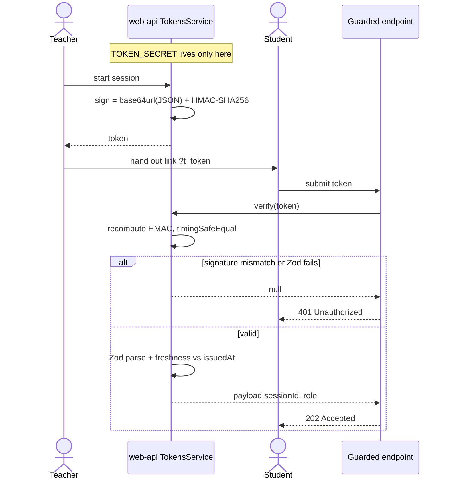

**Examples**

#### Example 1: Signing — payload + HMAC, joined with a dot
Serialize the payload to base64url, append `"." + HMAC_SHA256(body)`. The secret never leaves this service; tokens are minted server-side only.
```ts
// body = base64url(JSON), signature = base64url(HMAC-SHA256(body, secret))
sign(payload: TokenPayload): string {
  const body = Buffer.from(JSON.stringify(payload)).toString('base64url');
  return `${body}.${this.hmac(body)}`;
}

private hmac(body: string): string {
  return createHmac('sha256', this.config.env.TOKEN_SECRET)
    .update(body)
    .digest('base64url');
}
```
*Source: lobbi/web-api/src/tokens/tokens.service.ts*

#### Example 2: Verifying — constant-time compare, then validate
Split on `.`, recompute the HMAC, and compare with `timingSafeEqual` (never `===`, which leaks timing). Length-check first since `timingSafeEqual` throws on unequal-length buffers. Only after the signature passes do we JSON-parse and Zod-validate.
```ts
verify(token: string): TokenPayload | null {
  const parts = token.split('.');
  if (parts.length !== 2) return null;
  const [body, sig] = parts;

  const expected = this.hmac(body);
  const a = Buffer.from(sig);
  const b = Buffer.from(expected);
  // length guard: timingSafeEqual throws if buffers differ in length
  if (a.length !== b.length || !timingSafeEqual(a, b)) return null;

  try {
    const json: unknown = JSON.parse(Buffer.from(body, 'base64url').toString('utf8'));
    const parsed = TokenPayload.safeParse(json); // shape trusted only post-HMAC
    return parsed.success ? parsed.data : null;
  } catch {
    return null;
  }
}
```
*Source: lobbi/web-api/src/tokens/tokens.service.ts*

#### Example 3: Payload schema + expiry check against `issuedAt`
The Zod schema is the source of truth for the decoded payload; a literal `kind`/`role` field gives *domain separation* so one token type can't validate as another. The real service stamps `issuedAt` and validates shape only — enforce a TTL at the call site.
```ts
// Real schema (lobbi/packages/shared/src/index.ts):
export const TokenPayload = z.object({
  promptId: z.string().uuid(),
  sessionId: z.string().uuid(),
  studioId: z.string().uuid(),
  role: ResponseRole,
  issuedAt: z.number().int().positive(), // minted with Date.now()
});

// Illustrative TTL guard at the consuming endpoint:
const MAX_AGE_MS = 12 * 60 * 60 * 1000;          // 12h
const p = tokens.verify(token);                   // signature + shape first
if (!p || Date.now() - p.issuedAt > MAX_AGE_MS) { // …then freshness
  throw new UnauthorizedException('expired-or-invalid');
}
```
*Source: schema is real (lobbi/packages/shared/src/index.ts); the TTL guard is **Illustrative** — the service signs/verifies only, expiry is caller-enforced.*

**Reference implementation** — `lobbi` & `community-reflection-platform` `TokensService`; planned in `chorus` (signed unlock tokens).

**Gotchas / tradeoffs** — Rotating `TOKEN_SECRET` invalidates all outstanding tokens — plan rotation. No revocation without extra state. Always constant-time compare; always validate `exp`.

---

## 7. Internal API-key guard

**Problem & when to use** — Lock down service-to-service calls (BFF → domain API, or mobile → API) so the API isn't usable by arbitrary callers. Pairs with pattern 1.

**Stack** — NestJS guard · a shared secret (`INTERNAL_API_KEY` via `x-internal-key`, or `x-api-key`).

**How to build it**
1. The caller (Next BFF or mobile app) sends `x-internal-key: <secret>` on every request.
2. A Nest guard checks the header against the env secret with a constant-time compare; reject otherwise.
3. Apply it globally (or per-controller) on the domain API.
4. Use distinct keys per caller where useful (e.g., `WEB_API_KEY`, `MUSIC_API_KEY`).

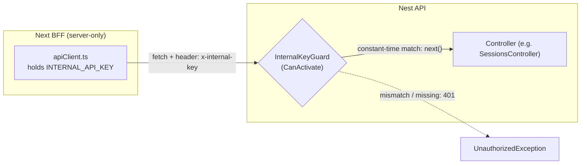

**Examples**

#### Example 1: The Nest guard (real code)
A `CanActivate` guard reads the `x-internal-key` header and rejects any request whose key doesn't match `INTERNAL_API_KEY`. This is *transport* auth (is this a trusted service?), not *user* auth — it carries no identity.
```ts
@Injectable()
export class InternalKeyGuard implements CanActivate {
  constructor(private readonly config: AppConfig) {}

  canActivate(ctx: ExecutionContext): boolean {
    const req = ctx.switchToHttp().getRequest<{
      headers: Record<string, string | string[] | undefined>;
    }>();
    const key = req.headers['x-internal-key'];
    // NOTE: direct compare — see Example 2 for the constant-time hardening.
    if (typeof key !== 'string' || key !== this.config.env.INTERNAL_API_KEY) {
      throw new UnauthorizedException('internal-key');
    }
    return true;
  }
}
```
*Source: lobbi/web-api/src/common/auth/internal-key.guard.ts*

#### Example 2: Constant-time compare with node:crypto
A plain `!==` can leak the secret through timing (it returns on the first differing byte). `timingSafeEqual` always compares the full buffer. It throws on length mismatch, so guard the lengths first.
```ts
import { timingSafeEqual } from 'node:crypto';

function keyMatches(provided: unknown, expected: string): boolean {
  if (typeof provided !== 'string') return false;
  const a = Buffer.from(provided);
  const b = Buffer.from(expected);
  if (a.length !== b.length) return false;   // timingSafeEqual requires equal lengths
  return timingSafeEqual(a, b);
}
```
*Illustrative — hardens the Example 1 compare; same guard contract.*

#### Example 3: The Next BFF attaches the header
A `server-only` client holds the secret and the API base URL — never imported into a client component, so the key stays out of the browser. Every server-to-server `fetch` stamps the `x-internal-key` header.
```ts
import "server-only";

function cfg() {
  const base = process.env.WEB_API_BASE_URL;
  const key = process.env.INTERNAL_API_KEY;
  if (!base || !key) throw new Error("Missing WEB_API_BASE_URL or INTERNAL_API_KEY");
  return { base, key };
}

export async function resolveSession(studioQrId: string) {
  const { base, key } = cfg();
  const res = await fetch(`${base}/sessions/resolve`, {
    method: "POST",
    headers: { "content-type": "application/json", "x-internal-key": key }, // ← guarded hop
    body: JSON.stringify({ studioQrId }),
    cache: "no-store",
  });
  // … parse res …
}
```
*Source: lobbi/web/src/lib/apiClient.ts (elided)*

**Reference implementation** — `lobbi` (Next → Nest), `canvas` (mobile → APIs), `michelin-map`, `yogicam`.

**Gotchas / tradeoffs** — This is a shared secret, **not** user auth — combine with Supabase/Firebase auth for end-user identity. The key lives only in server env, never in the browser. Rotate on leak.

---

## 8. On-device end-to-end encryption

**Problem & when to use** — Privacy-first apps where the server must **never** see plaintext (journals, health, private notes), yet you still need sync/backup. 

**Stack** — `encrypt` + `pointycastle` (Dart) · AES-256-GCM · PBKDF2 / HKDF key derivation · flutter_secure_storage · server stores ciphertext blobs only.

**How to build it**
1. Derive a content key from a user secret (passphrase, or a biometric-unlocked key) via PBKDF2; derive per-purpose subkeys with HKDF.
2. Encrypt content client-side with AES-256-GCM — a **unique nonce per blob**; store nonce + auth tag alongside the ciphertext.
3. Keep keys in `flutter_secure_storage` (Keychain / Keystore); never transmit them.
4. Upload only ciphertext to Supabase Storage/Postgres, namespaced per user (`/{user_id}/{type}/{id}.enc`).
5. If the server must process content, hand it a **one-time** key over mutual TLS, decrypt in-heap, then purge.

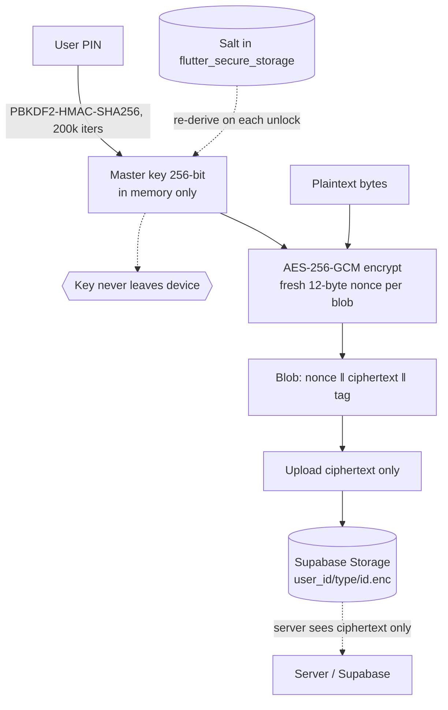

**Examples**

#### Example 1: Derive the master key from a PIN (PBKDF2) and a job key (HKDF)
Key material never touches disk: PBKDF2 stretches the PIN into a 256-bit key; HKDF re-derives a one-time, job-scoped key from that master key for server jobs. Only the random salt is persisted (in secure storage); the keys live in memory.
```dart
// PBKDF2-HMAC-SHA256, 200k iterations (OWASP 2023). Salt is 16 random bytes,
// stored in flutter_secure_storage so the same key re-derives on each unlock.
Uint8List deriveKey({required String passphrase, required Uint8List salt,
    int iterations = 200000, int keyLengthBytes = 32}) {
  final pbkdf2 = PBKDF2KeyDerivator(HMac(SHA256Digest(), 64))
    ..init(Pbkdf2Parameters(salt, iterations, keyLengthBytes));
  return pbkdf2.process(Uint8List.fromList(passphrase.codeUnits));
}

// HKDF-SHA256: one-time key per server job, derived from the master key.
Uint8List hkdfExpand({required Uint8List masterKey, required String info,
    int outputLength = 32}) {
  final hkdf = HKDFKeyDerivator(SHA256Digest());
  hkdf.init(HkdfParameters(masterKey, outputLength,
      Uint8List(32) /* zero salt, RFC 5869 */, Uint8List.fromList(info.codeUnits)));
  return hkdf.process(masterKey);
}
```
*Source: chapters-mobile/lib/core/crypto/key_derivation.dart*

#### Example 2: Encrypt on-device with AES-256-GCM (unique nonce + auth tag)
A fresh 12-byte nonce is generated **per blob** from a CSPRNG — never reused under the same key — and the 16-byte GCM tag authenticates the ciphertext, so a wrong key or tampered bytes fail to decrypt. The master key is held in memory only.
```dart
// Blob layout: [12-byte nonce][ciphertext + 16-byte GCM auth tag]
Uint8List encryptBytesRaw(Uint8List data) {
  _assertUnlocked();                              // key in memory, never on disk
  final nonce = enc.IV(_randomBytes(12));         // UNIQUE per blob (Random.secure)
  final encrypter = enc.Encrypter(enc.AES(_key!, mode: enc.AESMode.gcm));
  final encrypted = encrypter.encryptBytes(data, iv: nonce);
  final out = Uint8List(12 + encrypted.bytes.length)
    ..setRange(0, 12, nonce.bytes)                // prepend nonce …
    ..setRange(12, out.length, encrypted.bytes);  // … then cipher+tag
  return out;
}

static final _rng = Random.secure();
static Uint8List _randomBytes(int n) =>
    Uint8List.fromList(List.generate(n, (_) => _rng.nextInt(256)));
```
*Source: chapters-mobile/lib/core/crypto/crypto_service.dart*

#### Example 3: Upload ciphertext only to namespaced Supabase Storage
The encrypted blob is uploaded as-is to a per-user, per-type path — the server stores opaque bytes and never receives the key or plaintext. Paths are namespaced so the app layer can't cross-read between users.
```dart
// what lands on disk and on the wire is already encrypted:
final blob = crypto.encryptBytesRaw(bytes);       // AES-256-GCM, unique nonce
await file.writeAsBytes([...kMediaMagic, ...blob]); // 'CHE1' ‖ nonce ‖ cipher+tag

// push the SAME ciphertext to Storage, under a per-user namespace:
String _mediaPath(int id) => '$userId/media/$id.enc';
await _supabase.storage.from('media').uploadBinary(
    _mediaPath(m.id), bytes, fileOptions: const FileOptions(upsert: true));
```
*Source: chapters-mobile/lib/core/crypto/media_crypto_file.dart, lib/core/services/media_storage_service.dart (condensed)*

**Reference implementation** — `chapters`: encrypted journal via `encrypt` + `pointycastle`; server-side AES-GCM decrypt-then-purge using HKDF-derived one-time keys over an mTLS job-key protocol.

**Gotchas / tradeoffs** — Key loss = data loss (no server recovery) — design recovery deliberately. GCM **nonce reuse is catastrophic** — never reuse. Crypto is easy to get subtly wrong; keep it in one small, audited module.

---

## 9. Flutter clean-layered with Riverpod

**Problem & when to use** — Any non-trivial Flutter app that needs testable state and a clear data path.

**Stack** — Drift (SQLite) · a repository/service layer · Riverpod (flutter_riverpod) · go_router · build_runner codegen.

**How to build it**
1. **DB:** Drift tables + DAOs; generate code with `build_runner`.
2. **Repository / Service:** wrap DAOs and remote clients; expose domain methods; no widgets here.
3. **Providers:** Riverpod providers expose services and state (`AsyncNotifier` / `Notifier`); share a `ProviderContainer` between app and tests.
4. **UI:** widgets watch providers; no business logic in widgets.
5. **Routing:** go_router for declarative navigation.
6. Test with an in-memory Drift DB and `ProviderContainer` overrides.

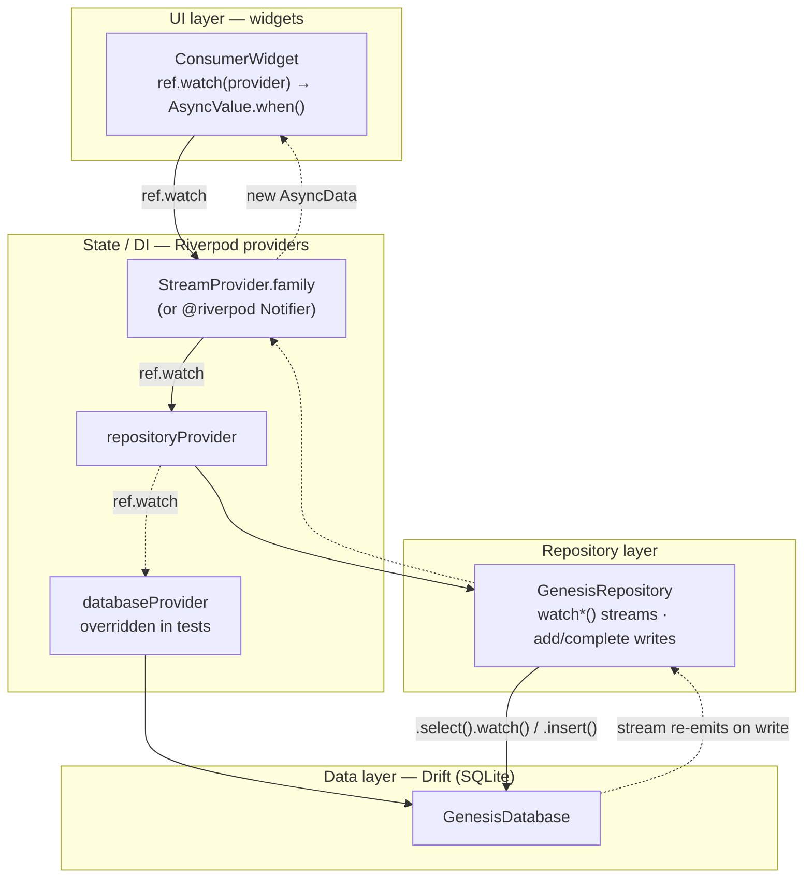

**Examples**

#### Example 1: Drift table (schema as typed Dart)
A `Table` subclass declares columns with constraints and FKs; `build_runner` generates the `Task` data class and `TasksCompanion`. SQLite check-constraints encode invariants right at the schema.
```dart
class Tasks extends Table {
  IntColumn get id => integer().autoIncrement()();
  IntColumn get eraId => integer().references(Eras, #id)();
  DateTimeColumn get date => dateTime()();
  TextColumn get title => text()();
  IntColumn get pillarId => integer().references(Pillars, #id)();
  IntColumn get goalId => integer().nullable().references(Goals, #id)();
  IntColumn get difficulty => integer().nullable()
      .check(CustomExpression<bool>('difficulty BETWEEN 1 AND 5'))();
  BoolColumn get done => boolean().withDefault(const Constant(false))();
}

@DriftDatabase(tables: [Eras, Pillars, Goals, Tasks /* … */])
class GenesisDatabase extends _$GenesisDatabase {
  GenesisDatabase(super.e);
  @override
  int get schemaVersion => 2; // additive migrations only
}
```
*Source: genesis/lib/data/database.dart*

#### Example 2: Repository — streamed reads + writes over Drift
The repository is the only thing that touches Drift. Reads return `.watch()` streams (so the UI re-renders on any change); writes go through the same DB, which makes those streams re-emit.
```dart
class GenesisRepository {
  GenesisRepository(this._db);
  final GenesisDatabase _db;

  /// Tasks for [eraId] on the calendar day of [date] — a live stream.
  Stream<List<Task>> watchTasksForDay(int eraId, DateTime date) {
    final start = DateTime(date.year, date.month, date.day);
    final end = start.add(const Duration(days: 1));
    return (_db.select(_db.tasks)
          ..where((t) =>
              t.eraId.equals(eraId) &
              t.date.isBiggerOrEqualValue(start) &
              t.date.isSmallerThanValue(end)))
        .watch();
  }

  /// Write path: inserting re-emits watchTasksForDay above.
  Future<int> addTask({required int eraId, required DateTime date,
      required String title, required int pillarId, int? goalId}) {
    return _db.into(_db.tasks).insert(TasksCompanion.insert(
          eraId: eraId, date: date, title: title,
          pillarId: pillarId, goalId: Value(goalId)));
  }
}
```
*Source: genesis/lib/data/genesis_repository.dart*

#### Example 3: Riverpod providers — DI + reactive exposure
`databaseProvider` and `repositoryProvider` wire the dependency graph (the DB provider is what tests override). A `StreamProvider.family` exposes a repository stream keyed by args.
```dart
/// The app database. Overridden in tests with an in-memory database.
final databaseProvider = Provider<GenesisDatabase>((ref) {
  final db = GenesisDatabase(openConnection());
  ref.onDispose(db.close);
  return db;
});

final repositoryProvider = Provider<GenesisRepository>((ref) {
  return GenesisRepository(ref.watch(databaseProvider));
});

typedef TodayTasksArgs = ({int eraId, DateTime date});

final todayTasksProvider =
    StreamProvider.family<List<Task>, TodayTasksArgs>((ref, args) {
  return ref.watch(repositoryProvider).watchTasksForDay(args.eraId, args.date);
});
```
*Source: genesis/lib/app/providers.dart*
> Variant: with `riverpod_annotation` codegen this becomes an `@riverpod` function or `AsyncNotifier`, exposing the same `AsyncValue` to widgets.

#### Example 4: Widget — `ref.watch` + `AsyncValue.when`
A `ConsumerWidget` watches the family provider and renders the three `AsyncValue` states. Each new emission from the underlying Drift stream rebuilds only this widget.
```dart
class TodayScreen extends ConsumerWidget {
  const TodayScreen({required this.era, super.key});
  final Era era;

  @override
  Widget build(BuildContext context, WidgetRef ref) {
    final today = ref.watch(todayProvider);
    final tasks = ref.watch(todayTasksProvider((eraId: era.id, date: today)));

    return tasks.when(
      data: (ts) => ts.isEmpty ? const _EmptyInvitation() : _TaskList(tasks: ts),
      loading: () => const Center(child: CircularProgressIndicator()),
      error: (_, __) => const Center(child: Text('Could not load today.')),
    );
  }
}
```
*Source: genesis/lib/ui/today/today_screen.dart (elided)*
> Testable by construction: build `GenesisDatabase(NativeDatabase.memory())` and a `ProviderContainer(overrides: [databaseProvider.overrideWith((ref) => db)])`.

**Reference implementation** — `genesis`, `chapters`, `everyday-todo-list` (and the timers app).

**Gotchas / tradeoffs** — Mind Drift's codegen quirks (e.g., aliasing its `Timer` data class to avoid clashing with `dart:async`); keep `*.g.dart` generated. Don't reach into the DB from widgets. Riverpod provider scoping matters for tests.

---

## 10. Offline-first local-SQLite source of truth

**Problem & when to use** — The app must work fully offline and sync when online, with the **local** DB authoritative. Productivity / journal apps.

**Stack** — Drift (local SQLite, authoritative) · PowerSync (self-hosted on Fly.io) ↔ Supabase Postgres · drift_sqlite_async · RLS-bucketed sync.

**How to build it**
1. The local Drift DB is the source of truth; UI reads/writes locally and stays responsive offline.
2. PowerSync streams changes between local SQLite and Supabase Postgres; bridge it to Drift with `drift_sqlite_async`.
3. Define sync rules bucketed by `user_id`; enforce RLS in Postgres; a Supabase JWT authorizes downloads.
4. Direct uploads under RLS via a PowerSync `BackendConnector` (PostgREST).
5. For ordering/reorder, use fractional indexing (LexoRank-style `order_key`) for O(1) moves.
6. Self-host PowerSync in Docker on Fly.io.

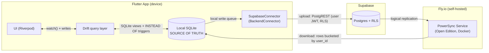

**Examples**

#### Example 1: `BackendConnector.uploadData` — direct client uploads
PowerSync drains the **local** write queue and the connector replays each CRUD op to Supabase over PostgREST under the user's JWT (RLS enforced). Fatal 4xx data errors are discarded so the queue can't loop forever; transient errors rethrow to retry.
```dart
class SupabaseConnector extends PowerSyncBackendConnector {
  SupabaseClient get _client => Supabase.instance.client;

  @override
  Future<void> uploadData(PowerSyncDatabase database) async {
    final tx = await database.getNextCrudTransaction();
    if (tx == null) return; // nothing queued
    try {
      for (final op in tx.crud) {
        final table = _client.from(op.table);
        switch (op.op) {
          case UpdateType.put:    await table.upsert({'id': op.id, ...?op.opData});
          case UpdateType.patch:  await table.update(op.opData!).eq('id', op.id);
          case UpdateType.delete: await table.delete().eq('id', op.id);
        }
      }
      await tx.complete(); // ack → drops ops from the local queue
    } on PostgrestException catch (e) {
      // permanently bad write → ack & drop, else rethrow to retry after backoff
      if (e.code != null && _isFatal(e.code!)) { await tx.complete(); } else { rethrow; }
    }
  }
}
```
*Source: app/lib/data/powersync/connector.dart (lightly trimmed)*

#### Example 2: Sync rules — download bucketed by `user_id`
Server-side rules that decide what each device **pulls down**. One bucket per user; `token_parameters.user_id` comes from the Supabase JWT `sub` claim. Upload is separate (Example 1) — this governs download only.
```yaml
# supabase/powersync/sync-rules.yaml
bucket_definitions:
  user_data:
    parameters: SELECT token_parameters.user_id AS user_id   # JWT sub → bucket param
    data:
      # device only ever receives its owner's rows
      - SELECT * FROM entries     WHERE user_id = bucket.user_id
      - SELECT * FROM tasks       WHERE user_id = bucket.user_id
      - SELECT * FROM attachments WHERE user_id = bucket.user_id
```
*Source: supabase/powersync/sync-rules.yaml*

#### Example 3: Drift ↔ PowerSync wiring (local SQLite is the source of truth)
PowerSync owns the schema (tables are SQLite **views** with `INSTEAD OF` triggers), so Drift runs no DDL — every migration hook is a no-op. Drift reads/writes the views, and `watch()` re-emits whenever PowerSync pushes a change down or a local write lands.
```dart
// main.dart — open local DB first, connect sync after, hand the same db to Drift
final sync = await PowerSyncService.open();      // PowerSyncDatabase(schema, path)
sync.start(Supabase.instance.client);            // connect on sign-in / clear on sign-out
final db = AppDatabase(SqliteAsyncDriftConnection(sync.db)); // Drift over PowerSync SQLite

// app_database.dart — PowerSync owns DDL, so Drift migrations are no-ops
@override
MigrationStrategy get migration => MigrationStrategy(
      onCreate: (m) async {},          // …never CREATE TABLE — views already exist
      onUpgrade: (m, from, to) async {},
    );

// reactive read straight off the local source of truth (fractional order_key)
Stream<List<Task>> watchTasksForDate(String userId, String date) =>
    (select(tasks)..orderBy([(t) => OrderingTerm.asc(t.orderKey)])).watch();
```
*Source: app/lib/main.dart + app/lib/data/database/app_database.dart (condensed)*

**Reference implementation** — `everyday-todo-list`: Drift + self-hosted PowerSync ↔ Supabase; partial in `chapters`.

**Gotchas / tradeoffs** — Conflict policy must be explicit. Self-hosting PowerSync is ops you own. Use local at-rest encryption (PowerSync v2) if the data is sensitive.

---

## 11. Cross-platform design tokens

**Problem & when to use** — You ship web **and** Flutter and want one source of truth for color/spacing/type so the platforms can't drift. Any multi-platform product with a design system.

**Stack** — DTCG token JSON · Style Dictionary v4 · culori (OKLCH) · outputs: CSS variables + a Tailwind preset + Flutter Dart · published as a package (GitHub Packages).

**How to build it**
1. Author tokens once as DTCG JSON (primitives + semantics).
2. Generate perceptually-even ramps with culori (OKLCH), pinning brand anchors.
3. Compile with Style Dictionary to three outputs: CSS variables, a Tailwind preset, and Flutter Dart (e.g., a `DsColors` class).
4. Publish a versioned package (e.g., `@camerongamble36/canvas-design`) to GitHub Packages; consume it in web (Tailwind preset) and Flutter (generated Dart via a `canvas_tokens` package).
5. Layer app-specific tokens as a Flutter `ThemeExtension` on top.

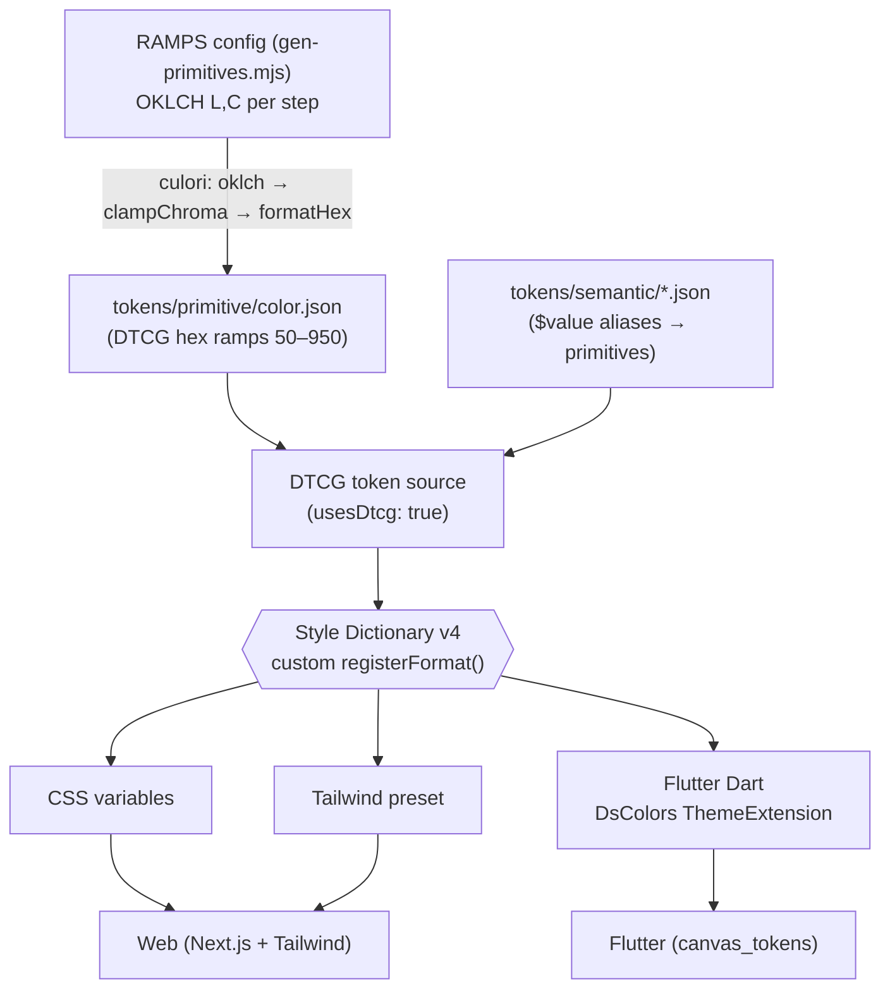

**Examples**

#### Example 1: DTCG semantic tokens alias the OKLCH-generated primitives
Semantic tokens never hardcode hex — each `$value` references a primitive step (`{color.primary.500}`), so a ramp tweak repaints every platform. `$description` carries the contrast rationale into generated doc comments.
```json
{
  "color": {
    "text": {
      "$type": "color",
      "primary": { "$value": "{color.neutral.950}", "$description": "Body/heading text. 18.7:1 on white — AAA." },
      "link":    { "$value": "{color.primary.500}", "$description": "Hyperlinks. 5.9:1 on white — AA." }
    },
    "action": {
      "$type": "color",
      "primary": {
        "default":  { "$value": "{color.primary.500}" },
        "hover":    { "$value": "{color.primary.700}" },
        "disabled": { "$value": "{color.primary.200}" }
      }
    }
  }
}
```
*Source: tokens/semantic/color.json (abridged)*

#### Example 2: Perceptual ramps generated with culori (OKLCH → hex)
Each ramp is even in OKLCH lightness; brand anchors pin specific steps to exact hex. `clampChroma` keeps every step inside sRGB gamut before `formatHex` emits the DTCG primitive.
```js
import { oklch, clampChroma, formatHex } from 'culori';

// step: [oklchL, oklchC]; hue fixed per ramp; `anchor` pins a step to brand hex.
const RAMPS = {
  primary: {
    hue: 295.9, anchors: { 500: '#870FFF' },
    steps: { 50:[.955,.045], 500:[.542,.290], 950:[.255,.115] /* … */ },
  },
};

const toHex = (l, c, h) => formatHex(clampChroma({ mode: 'oklch', l, c, h }, 'oklch'));

for (const [name, ramp] of Object.entries(RAMPS))
  for (const [step, [l, c]] of Object.entries(ramp.steps))
    out.color[name][step] = { $value: (ramp.anchors?.[step] ?? toHex(l, c, ramp.hue)).toUpperCase() };
```
*Source: scripts/gen-primitives.mjs (abridged)*

#### Example 3: One custom Style Dictionary v4 format → Flutter `DsColor`
A `registerFormat` walks `dictionary.allTokens`, keeps only semantic colors, and emits Dart. The same dictionary feeds sibling formats (`canvas/css-variables`, `canvas/tailwind-preset`), so all targets stay in lockstep. Note v4's class constructor + `usesDtcg: true`.
```js
import StyleDictionary from 'style-dictionary'; // v4

StyleDictionary.registerFormat({
  name: 'canvas/flutter-colors',
  format: ({ dictionary, options }) => {
    const cls = options?.className ?? 'DsColor';
    const lines = dictionary.allTokens.filter(isSemantic).map((t) => {
      const name = camel(t.path.slice(1));            // color.text.primary → textPrimary
      const doc  = (t.$description ?? '').trim();
      return `${doc ? `  /// ${doc}\n` : ''}  static const Color ${name} = Color(${hexToFlutter(valueOf(t))});`;
    });
    return `class ${cls} {\n  ${cls}._();\n\n${lines.join('\n\n')}\n}\n`;
  },
});

await new StyleDictionary({
  source: ['tokens/primitive/*.json', 'tokens/semantic/color.json'],
  usesDtcg: true,
  platforms: {
    mobile: { transforms: ['attribute/cti', 'name/kebab'], buildPath: 'lib/generated/',
              files: [{ destination: 'ds_color.dart', format: 'canvas/flutter-colors' }] },
  },
}).buildAllPlatforms();
```
*Source: lib/build-tokens.mjs (abridged)* — generated result:
```dart
/// Hyperlinks. 5.9:1 on white — AA.
static const Color textLink = Color(0xFF870FFF);
```

**Reference implementation** — `canvas/design-system` (source of truth) → consumed by `genesis` (`canvas_tokens`) and `chapters` (build-time token generation).

**Gotchas / tradeoffs** — Adds a build step before platforms can consume tokens. Keep generation deterministic. Decide path-dep vs. git-dep vs. published-package per consumer (genesis currently uses a path dep).

---

## 12. Monorepo with shared schema package

**Problem & when to use** — Web and API (or app and API) must agree on types and validation. Use to kill drift between client and server contracts.

**Stack** — npm workspaces · a shared package exporting Zod schemas + inferred types (`@crp/shared`) · (or parallel Dart/TS model packages).

**How to build it**
1. `packages/shared` exports a Zod schema and `z.infer` type for every cross-boundary DTO.
2. Both web and API import from it and validate at **every** boundary with the same schema.
3. Use Zod for env parsing too.
4. Wire it with npm workspaces (`packages/*`, `web`, `web-api`); run web + API together in dev with `concurrently`.
5. For Flutter + TS stacks, keep parallel model packages in lockstep.

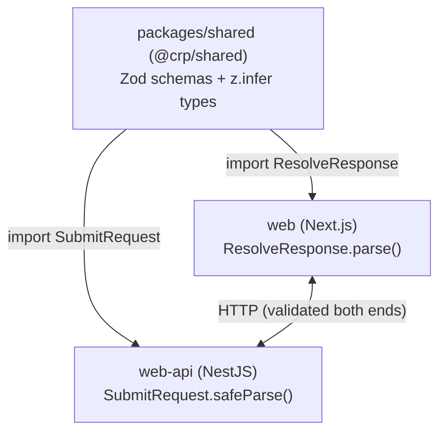

**Examples**

#### Example 1: One schema, one inferred type
The shared package is the single source of truth: each export is a Zod schema *and* (via `z.infer`) the TypeScript type, so the runtime validator and the compile-time type can never drift.
```ts
import { z } from "zod";

// POST /responses body — exactly one of responseText | chosenOption.
export const SubmitRequest = z
  .object({
    token: z.string().min(1),
    responseText: z.string().trim().min(1).max(2000).optional(),
    chosenOption: z.string().min(1).optional(),
    nickname: z.string().trim().min(1).max(40).optional(),
  })
  .refine(
    (v) => Boolean(v.responseText) !== Boolean(v.chosenOption),
    "Provide exactly one of responseText or chosenOption",
  );
export type SubmitRequest = z.infer<typeof SubmitRequest>; // consumers import this type

export const ResolveResponse = z.object({ token: z.string().min(1) });
export type ResolveResponse = z.infer<typeof ResolveResponse>;
```
*Source: packages/shared/src/index.ts*

#### Example 2: The API validates inbound requests with the schema
`web-api` (NestJS) treats every request body as `unknown` and runs the shared schema at the boundary with `safeParse`, returning a 400 on failure. Same schema the client trusts — no hand-written DTO.
```ts
import { SubmitRequest } from "@crp/shared";

@Controller("responses")
export class ResponsesController {
  constructor(private readonly responses: ResponsesService) {}

  @Post()
  async submit(@Body() body: unknown) {
    const parsed = SubmitRequest.safeParse(body);
    if (!parsed.success) throw new BadRequestException(parsed.error.flatten());
    return this.responses.submit(parsed.data); // parsed.data is typed SubmitRequest
  }
}
```
*Source: web-api/src/modules/responses/responses.controller.ts*

#### Example 3: The web app validates the response with the same package
`web` (Next.js) imports the *same* package and `parse`s the fetch response, so a contract change on the API surfaces as a type error or a thrown validation error on the client.
```ts
import { ResolveResponse } from "@crp/shared";

export async function resolveSession(studioQrId: string) {
  const res = await fetch(`${base}/sessions/resolve`, {
    method: "POST",
    headers: { "content-type": "application/json", "x-internal-key": key },
    body: JSON.stringify({ studioQrId }),
    cache: "no-store",
  });
  if (res.ok) {
    const data = ResolveResponse.parse(await res.json()); // validated at the boundary
    return { ok: true, token: data.token };
  }
  // … map 404 reasons …
}
```
*Source: web/src/lib/apiClient.ts*

#### Example 4: Workspaces wiring
npm workspaces links the local package by name; both consumers depend on `"@crp/shared": "*"`, and a `postinstall` builds it so the `dist/` types resolve. `concurrently` runs both apps in dev.
```json
// root package.json
{
  "workspaces": ["packages/*", "web-api", "web"],
  "scripts": {
    "build:shared": "npm run build -w @crp/shared",
    "postinstall": "npm run build:shared",
    "dev": "npm run build:shared && concurrently -n web-api,web \"npm run start:dev -w web-api\" \"npm run dev -w web\""
  }
}
// web/package.json and web-api/package.json both declare: "@crp/shared": "*"
```
*Source: package.json (root), web/package.json, web-api/package.json (trimmed)*

**Reference implementation** — `lobbi` & `community-reflection-platform` (`@crp/shared`, Zod); `yogaflow` (parallel `yogaflow-models` in Dart + TS).

**Gotchas / tradeoffs** — Parallel Dart/TS models can drift — a single Zod source is better when both sides are TS. Version the shared package carefully inside the monorepo.

---

## 13. Forced tool-use for structured LLM output

**Problem & when to use** — You need reliable **typed JSON** from Claude (not free text) for a product feature. Any LLM call whose output you parse programmatically.

**Stack** — Anthropic Claude Messages API · forced tool-use (`tool_choice`) · Zod validation · Promptfoo evals.

**How to build it**
1. Define the desired output as a tool / JSON schema.
2. Call the Messages API with that tool and **force** it (`tool_choice` set to the tool) so the model must return arguments matching the schema.
3. Validate the returned arguments with Zod before use; retry on mismatch.
4. Keep prompt templates in code and reuse the **same** templates in Promptfoo evals to test tone/values + structured-output correctness, graded by Claude.
5. Gate the feature on `ANTHROPIC_API_KEY`; keep it opt-in.

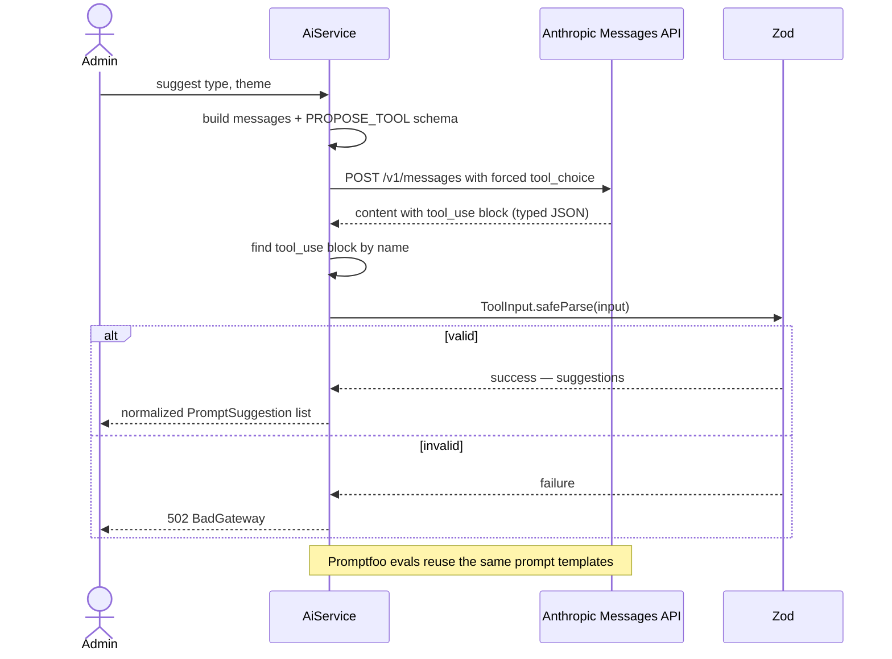

**Examples**

#### Example 1: Forced-tool request via raw `fetch`
Calls the Messages API with a single tool and `tool_choice` pinned to it, so the model must return typed JSON instead of prose. `tool_choice: { type: 'tool', name }` is the forcing mechanism.
```ts
res = await fetch('https://api.anthropic.com/v1/messages', {
  method: 'POST',
  headers: {
    'x-api-key': key,
    'anthropic-version': this.config.env.ANTHROPIC_VERSION, // "2023-06-01"
    'content-type': 'application/json',
  },
  body: JSON.stringify({
    model: this.config.env.ANTHROPIC_MODEL,
    max_tokens: 1024,
    temperature: 0.7,
    system: SYSTEM_PROMPT,
    tools: [PROPOSE_TOOL],                                  // tool w/ input_schema
    tool_choice: { type: 'tool', name: PROPOSE_TOOL.name }, // force this tool
    messages,
  }),
});
```
*Source: lobbi/web-api/src/modules/ai/ai.service.ts*

#### Example 2: Parse the `tool_use` block and validate with Zod
The structured output arrives as a `tool_use` content block whose `.input` is the typed JSON. Find that block by name, then validate it — never trust the shape blindly.
```ts
const ToolInput = z.object({
  suggestions: z.array(PromptSuggestion).min(1).max(3),
});

const body = (await res.json()) as {
  content?: { type: string; name?: string; input?: unknown }[];
} | null;
const toolUse = body?.content?.find(
  (b) => b.type === 'tool_use' && b.name === PROPOSE_TOOL.name,
);
const parsed = ToolInput.safeParse(toolUse?.input);
if (!parsed.success) throw new BadGatewayException('ai-bad-output');
return parsed.data.suggestions; // typed PromptSuggestion[]
```
*Source: lobbi/web-api/src/modules/ai/ai.service.ts (+ packages/shared for `PromptSuggestion`)*

#### Example 3: Promptfoo eval reusing the same prompt templates
The eval config grades the structured output for tone + shape; the custom provider imports the **compiled** production templates and makes the identical forced-tool call, so evals can't drift from runtime.
```yaml
# promptfooconfig.yaml
providers:
  - file://provider.js          # imports the compiled production prompt-templates
defaultTest:
  options:
    provider: anthropic:messages:claude-sonnet-4-5-20250929  # LLM-rubric grader
  assert:
    - type: is-json
    - type: javascript
      value: |
        const o = String(output).toLowerCase();
        const banned = ["winner","leaderboard","streak","crush it"];
        return banned.every((w) => !o.includes(w));
tests:
  - description: poll — 2–5 options, no correct answer
    vars: { type: poll, theme: class times }
    assert:
      - type: javascript
        value: |
          const s = JSON.parse(output).suggestions;
          return s.every((x) => x.options.length >= 2 && x.options.length <= 5 && !x.correctOption);
```
*Source: lobbi/evals/promptfooconfig.yaml (+ evals/provider.js)*

**Reference implementation** — `lobbi` (admin authoring assist — Suggest/Refine via forced tool-use, with Promptfoo evals); `yogicam` (Sanskrit/English asana-name translation).

**Gotchas / tradeoffs** — An over-complex schema causes more refusals/retries — keep it tight. Always validate output. Version prompts so evals catch regressions.
